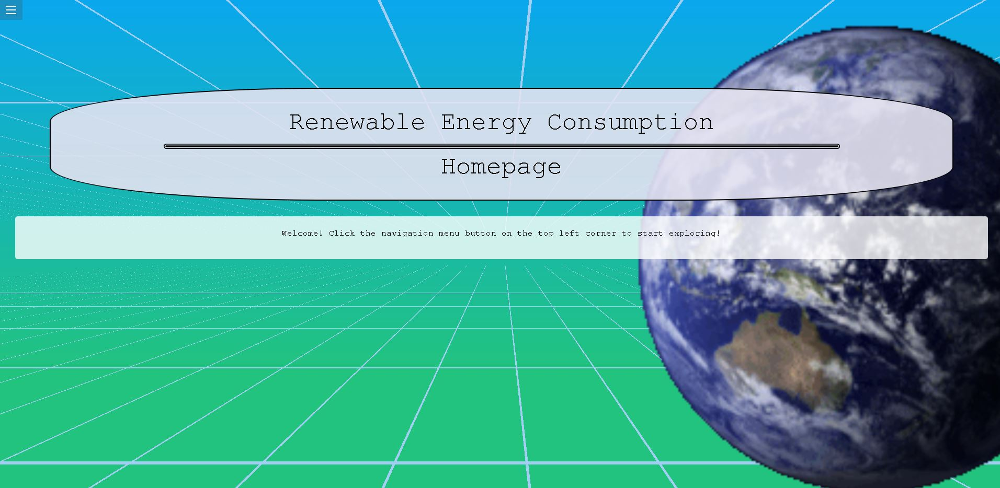

<div align="center">
    <h1>Dynamic Website Server Project</h1>
</div>



This project focused on developing a dynamic paths website in a team that models a specifc set of data. Sustainability was the topic chosen to base the data around. As a result, my team and I settled on a dataset that focuses on renewable fuels and their consumption throughout the United States as far back as the 1970s to current times. As you will see by the dynamic paths below, this data is organized by Sector (Residential, Industrial, etc...), State (Minnesota, Florida, California, etc...) and by Total across all sectors and all states for each year. Created using node, this project is a perfect example of creating a simple server side application to efficiently provide and display data based on the client's needs and wants.

It is important to note that this project was created in a classroom setting. Thereofore, after the assignment was completed, I took the liberity of patching, refactoring and fixing up the project to not only better understand the project, but to ensure that I understand the concepts included in this assignment completely. 

In terms of usefulness, this project can have a major impact. By using this application, one can more efficiently and easily review the data and complete reasonable observations in terms of where the United States sits when it comes to the use of renewable fuels and which sectors are taking the most advantage of these renewable resources. This project clearly outlines which sectors in the past have taken a slower approach in integrating various sustainable renewable resources and therefore can predict that it will be these same sectors that will likely continue in their slow trajectory of integrating renewable resources into their sector. 

---

## Directory Structure
```
/home
    /total
        /annual/:year
    /sector
        /annual/:year
    /state/:state
```

---

## Plug and Play

### This project is hosted online. You can check it out [here](https://renewable-energy.onrender.com). 

If you want to run it in your local environment take a look at the requirements and steps below.

~ Requirements ~

1. [Node.js](https://nodejs.org/en) must be installed 
2. Recommended to host this project in [Visual Studio Code](https://code.visualstudio.com/)

~ Steps ~

1. Download the code from this repository
2. Navigate to where file was placed on local envronment in IDE
3. In Terminal
    - 1. Install Dependencies: ``` npm install ```
    - 2. Run Project: ``` Node server.js ```
4. Go to desired browser and go to following url: localhost:8000/homepage

---

## Tools and Languages Used 
<div>
  &nbsp;
  &nbsp;
  &nbsp;
  &nbsp;
  &nbsp;
  
  
  
  
  
</div>
